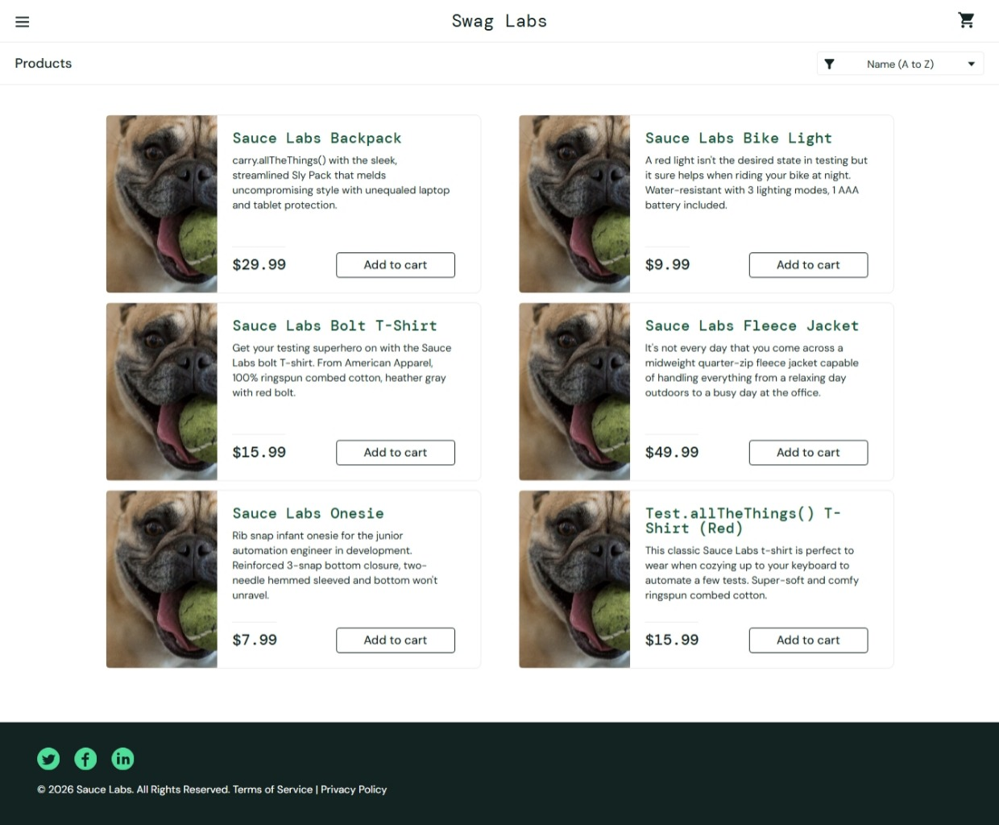

# BUG-001 – Incorrect Product Images for problem_user

## Bug Summary

Some product images are displayed incorrectly when logged in using `problem_user`.

---

## Bug Details

**Bug ID:** BUG-001

**Title:** Incorrect product images displayed for problem_user

**Severity:** Medium

**Priority:** Medium

**Environment:** Web Browser

**Website:** https://www.saucedemo.com/

**User:** `problem_user`

---

## Preconditions

- User is on the Swag Labs login page.
- Valid Swag Labs credentials are available.

---

## Steps to Reproduce

1. Open the Swag Labs website.
2. Enter username: `problem_user`.
3. Enter password: `secret_sauce`.
4. Click the **Login** button.
5. Open the Products page.
6. Observe the product images.

---

## Expected Result

Each product should display its correct corresponding product image.

---

## Actual Result

Some product images are displayed incorrectly and do not correspond to the expected products.

---
## Status

Open

---
## Evidence

Screenshot captured during testing shows dog images displayed instead of the expected product images.

