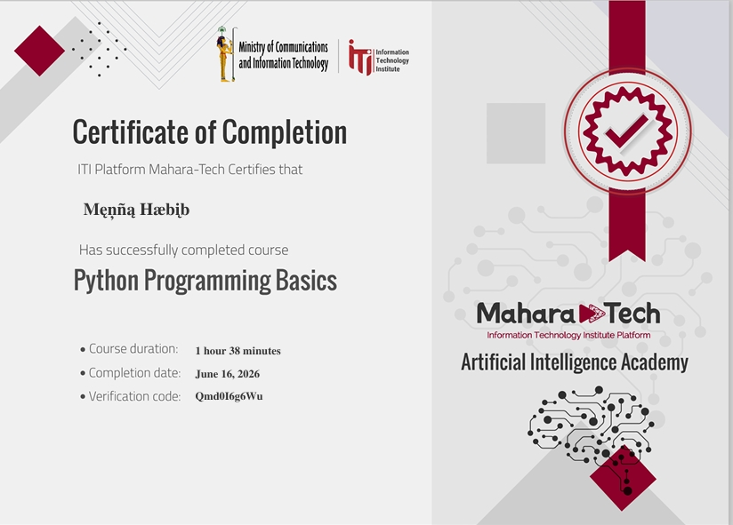

# 🧪 Software Testing Portfolio

Hello! I'm Menna Habib, a beginner Software Tester currently learning Software Testing and Java.

I'm building my testing skills through practical projects and hands-on testing exercises.

---

## 👩‍💻 About Me

I am a science student interested in Software Testing.

Currently, I am learning:

- Manual Testing
- Exploratory Testing
- Test Case Design
- Bug Reporting
- Functional Testing
- Java & OOP
- Git & GitHub

---

## 🧪 Projects

### Project 1: Swag Labs – Manual Testing

**Website:** https://www.saucedemo.com/

**Testing Type:** Manual Testing – Exploratory & Functional Testing

**Date:** July 22, 2026

#### 🎯 Project Objective

The objective of this project was to manually test the Swag Labs website and evaluate its main functionalities from a user's perspective.

#### 🔍 Testing Scope

The following functionalities were tested:

- Login
- Product browsing
- Product details
- Add to Cart
- Shopping Cart
- Checkout

#### 📊 Test Execution Summary

| Module | Test Cases | Passed | Failed |
|---|---:|---:|---:|
| Login | 10 | 10 | 0 |
| Products | 8 | 8 | 0 |
| Shopping Cart | 8 | 8 | 0 |
| Checkout | 8 | 8 | 0 |
| **Total** | **34** | **34** | **0** |

**Pass Rate: 100%**

#### 🐞 Defects Found

**1 Bug** was identified during testing:

- **BUG-001:** Incorrect Product Images for `problem_user`
- **Severity:** Medium
- **Priority:** Medium
- **Status:** Open

The bug was documented with reproduction steps and screenshot evidence.

#### 📋 Test Documentation

- [Login Test Cases](Test-Cases/Swag%20Labs/Login-Test-Cases.md)
- [Products Test Cases](Test-Cases/Swag%20Labs/Products-Test-Cases.md)
- [Cart Test Cases](Test-Cases/Swag%20Labs/Cart-Test-Cases.md)
- [Checkout Test Cases](Test-Cases/Swag%20Labs/Checkout-Test-Cases.md)
- [Bug Report](Bug-Reports/Swag%20Labs/BUG-001.md)
- [Test Summary](Test-Summary/Swag-Labs-Test-Summary.md)

### 🖥️ Project Screenshot

---

### Project 2: ParkPulse – Amusement Park Management System

**Project Type:** Team Software Development Project

**Language:** Java

**Development Approach:** Object-Oriented Programming (OOP)

#### 🎯 Project Overview

ParkPulse is a Java-based Amusement Park Management System designed to manage different park operations, including customers, employees, rides, tickets, bookings, payments, food items, and offers.

The project was developed as a team project using Java and Object-Oriented Programming concepts.

#### 🛠️ Technologies & Concepts

- Java
- Object-Oriented Programming (OOP)
- Java Swing GUI
- Git & GitHub
- Team Collaboration

#### 👩‍💻 My Contribution

I worked on the **Users & Staff Hierarchy** section of the system.

My contribution included implementing:

- `Person` – Abstract base class for common person information.
- `Customer` – Represents park customers and manages customer-related attributes.
- `Employees` – Base class for employee information.
- `Manager` – Represents the manager role.
- `Cashier` – Represents the cashier role.
- `RideOperator` – Represents the ride operator role.

#### 📚 OOP Concepts Applied

- Abstraction
- Inheritance
- Encapsulation
- Constructors
- Class Relationships

#### 🔗 Project Repository

[View the Amusement Park Management System on GitHub](https://github.com/hagarabseed/Amusement-Park-System)

### 🖥️ Project Screenshot

---
## 🛠️ Skills & Tools
 
### Testing

- Manual Testing
- Exploratory Testing
- Functional Testing
- Test Case Design
- Bug Reporting
- Test Documentation

### Technical

- Java
- Object-Oriented Programming (OOP)
- Git
- GitHub

---

## 🎓 Certificates

### Python Programming Basics

- **Issued by:** ITI Mahara-Tech
- **Organization:** Information Technology Institute (ITI)
- **Course:** Python Programming Basics
- **Completion Date:** June 16, 2026
- **Course Duration:** 1 hour 38 minutes

---

## 🔗 Links

- **Website Tested:** https://www.saucedemo.com/
- **GitHub:** https://github.com/habibmenna161-max
- **LinkedIn:** www.linkedin.com/in/menna-habib-765350417

---

## 📬 Contact

- **GitHub:** https://github.com/habibmenna161-max
- **LinkedIn:** www.linkedin.com/in/menna-habib-765350417